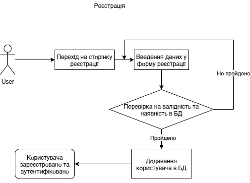
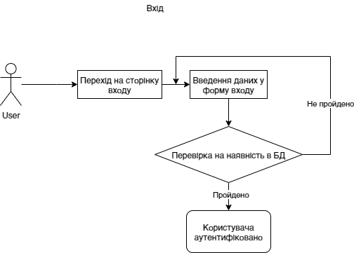
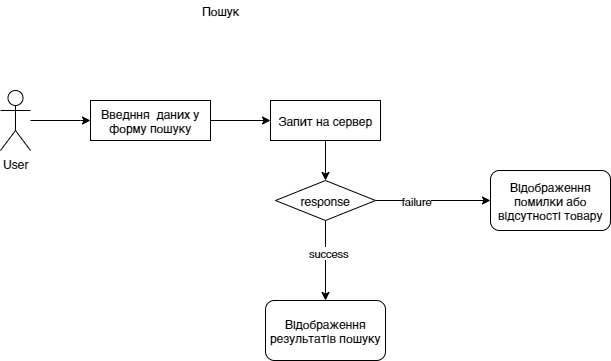
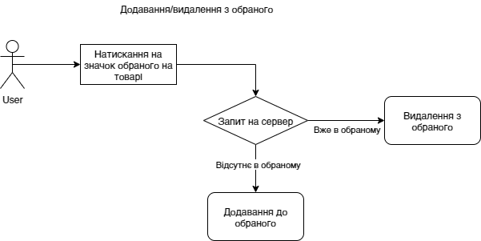
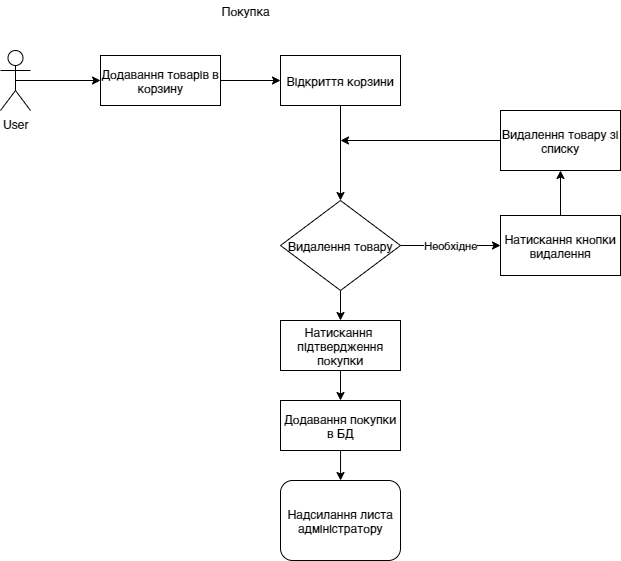
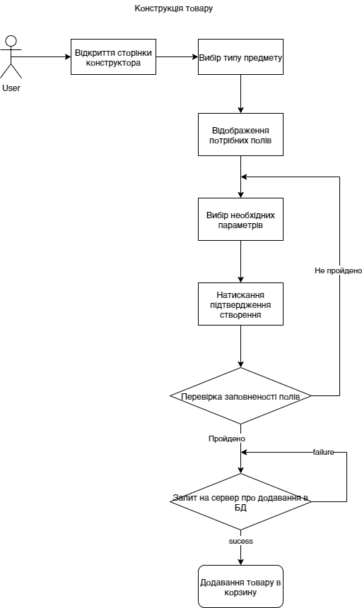
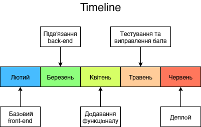

# KvJewelry 
Бойківський Андрій,

Зубець Микола

## Опис проекту
Суть проекту у створенні адаптивного інтернет-магазину ювелірних виробів з можливістю конструювання, перегляду, пошуку та замовлення товарів різних категорій і інформативною частиною.

## Актуальність проекту

Актуальність та перевага нашого ювелірного сайту щодо інших буде виражена у конструкторі виробів, що буде мати велику функціональність та зручність на відміну від подібних існуючих сайтів та перевірку наявності товару у реальному часі через інформацію зі складу.
 
## Функціональність проекту
Роздивимось наявність різних пунктів, що реалізовані на інших ювелірних сайтах:

 | Пункт            | Наявність       | 
 | :------------------- | :----------------------: | 
| Пошук товарів| ✓                    |
| Кошик товарів | ✓                   |
| Розділення на категорії | ✓ |
| Сортування товарів | ✓         |
| Сучасний дизайн  |—              |
|Адаптивність|✓                        |
| Конструктор товарів| ✓        |
| Оцінка наявності| ✓               |
| Інформаційні сторінки | ✓    |
| Realtime підтримка       | —    |
| Підтримка через пошту | ✓  |
|Персональний кабінет|✓       |
|База даних товарів|✓             |

/>

/>

Щодо відсутніх пунктів:

- Сучасний дизайн 

  Складність реалізації приємного, адаптивного дизайну у відсутності досвіду оформлення та поганих творчіх здібностях розробників 😒.
 
- Підтримка у реальному часі

  Неможливість реалізації у відсутності відповідного персоналу для моніторингу, але при цьому буд присутній зворотній зв'язок через пошту.

Детальний опис інших пунктів:

- Кошик товарів

  Зміна товарів кошику буде реалізована у кнопці додати/видалити біля кожного товару та окремому вікні для маніпуляції з товарами кошика.
  
 - Конструктор товарів 
   
   Конструктор товарів буде представляти собою сторінку створення ювелірних виборів своєї комплектації для кожного виду товару з можливістю зміни усіх деталей та розмірів виробу.
  
 - Оцінка наявності
 
   Оцінка наявності буде здійснюватись через базу даних у реальному часі, куди дані будуть поступати з програми "1С підприємство". 
   
- Персональний кабінет
  
   Персональний кабінет буде доступний після реєстрації та буде давати доступ до обраних товарів, відслідковування зворотнього зв'язку та іншого.
  
 - Сортування товарів
 
   Сортування буде здійснюватись по спільним параметрам, як то ціна, розмір, наявність, новизна та особливим для кожної категорії (тип каменю, металу та інше).
  
## Стeк технологій

### Backend
- Сервер: Nodejs + Express

    Проста платформа для створення серверної частини з використанням JS, особливо у парі з фреймворком Express. Одні з найважливіших переваг Node.js, через які вона була обрана, – асинхронність та подієвий підхід, а також наявність досвіду з її використання.
- База даних: Sql

    Мова для управління даними реляційної бази даних. Реляційна база даних була обрана через бажання отримати просту та мобільну БД, в якій буде зберігатись лише текстова/числова інформація
- Склад: 1C Підприємство
    
    Ця платформа була обрана для оцінки наявності товару через взаємодію з інформацією зі складу.
    
### Frontend
- HTML, CSS
- Препроцесор: Pug

  Обраний для створення більш чистого коду та спрощення конструкцій через автогенерацію однотипних блоків, наслідування шаблонів та використання міксинів.
- Скріпти: JavaScript
- AJAX: Fetch

  Fetch API є сучасною альтернативою XMLHttpRequest. Інтерфейси Headers, Request і Response забезпечують узгодженість, в той час як Promises дозволяють спростити ланцюжка і async / await без зворотних викликів. Був обраний як альтернатива jQuery через його вбудованість у JS та зручність використання.
- Search: Elasticsearch

  Цей движок для пошуку був обраний через його велику швидкість виконання а також можливість взаємодії з SQL.
## Діаграми 

#

#

#

#

#

## Етапи розробки

